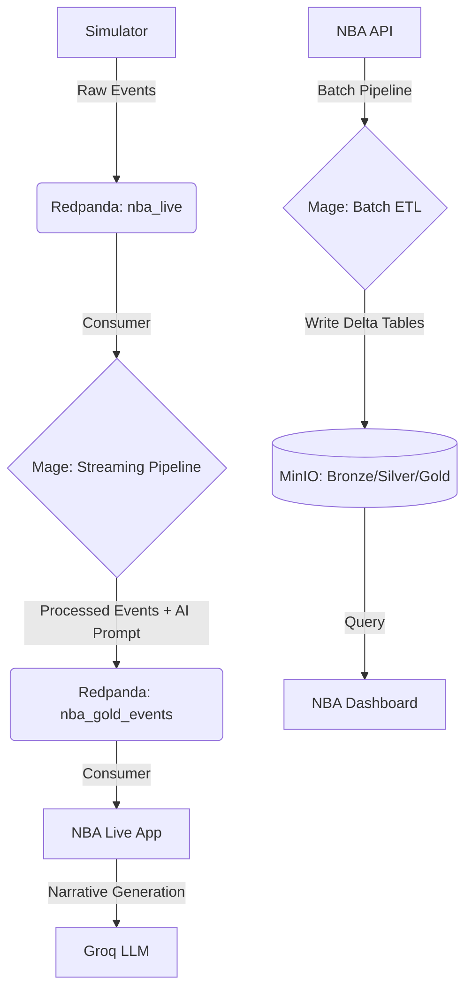

# PlaySynapse: Sports Analytics Platform

**Video Demo:** [https://youtu.be/yp8N_ug8NPM](https://youtu.be/yp8N_ug8NPM)

> **Master's Thesis — Master's in Big Data & Data Engineering**
> **Author:** Óscar Rico Rodríguez
> **Supervisors:** Jorge Centeno and Alberto González
> **Date:** February 2026

## 📄 Overview

**PlaySynapse** is a data engineering platform designed to unify historical sports analytics with the immediacy of artificial intelligence. The project addresses the challenge of integrating heterogeneous data sources — from historical statistical records to computer vision data streams — into a common architecture that democratises access to advanced insights.

The solution is built on a **containerised Lakehouse architecture**. For historical data, Batch pipelines are orchestrated with **Mage.ai** and processed with **Polars**. For the real-time component, a **Redpanda**-based Streaming system ingests and processes simulated game events, emulating the output of computer vision models. Finally, a **Generative AI** module (Llama 3 via Groq) transforms structured data into live tactical narratives — visualised in real time.

## 🎯 Project Goals

1. **Unified Data Pipeline**: Design a flow capable of processing both historical data and real-time events generated by computer vision models.
2. **Hybrid Architecture**: Implement an efficient Batch + Streaming system with Lakehouse storage (Medallion Architecture).
3. **GenAI-Powered Insights**: Apply generative AI to produce analytical narratives and natural-language commentary from sports metrics.
4. **Multi-Sport Scalability**: Design the platform with a sport-agnostic vision, enabling adaptation to other video-analytics domains.

## 🚀 Key Features

- **Real-Time Simulation**: Replay historical matches synchronised event by event.
- **Low-Latency Streaming**: Event-driven architecture using Redpanda (Kafka-compatible).
- **Data Lakehouse**: Scalable storage on MinIO (S3-compatible) in Delta Lake format.
- **Automated Narration**: Live AI commentator powered by Groq (Llama 3).
- **Modern Orchestration**: Data pipelines managed with Mage.ai.
- **Interactive Visualisation**: Analytical dashboard (Streamlit) and live narration app (Gradio).

## 🛠️ System Architecture

The data flow follows a modern Batch + Streaming architecture:



## 🏗️ Project Structure

- **`data_platform/`**: **Mage** orchestrator. Contains all data pipelines (ingestion, transformation, streaming).
- **`nba_dashboard/`**: **Streamlit** application for historical analytics visualisation.
- **`nba_live_app/`**: **Gradio** application for live AI narration.
- **`realtime_simulator.py`**: Simulation script that injects match events into the system in real time.
- **`docker-compose.yml`**: Infrastructure definition (containers).

## 💻 Prerequisites

- **Docker** and **Docker Compose**.
- **Python 3.9+** (optional, for local scripts).
- **Groq API Key** (required for AI narration).

## 🚀 Quick Start

### 1. Configuration

Clone the repository and set up your environment variables:

```bash
cp .env.example .env
# Edit .env and add your GROQ_API_KEY
```

### 2. Deploy

```bash
docker-compose up -d
```

Available services once running:

- **Mage (Orchestrator):** `http://localhost:6789`
- **Redpanda Console:** `http://localhost:8080`
- **MinIO Console:** `http://localhost:9001`
- **NBA Live App:** `http://localhost:7860`
- **NBA Dashboard:** `http://localhost:8501`

### 3. Run

1. In **Mage**, activate the `nba_pbp_realtime` pipeline.
2. Run the simulator locally:
    ```bash
    pip install -r requirements.txt
    python realtime_simulator.py
    ```
3. Open the **NBA Live App** to watch the live narration and the **NBA Dashboard** for historical analysis.

## 📊 Tech Stack

| Component          | Technology            | Purpose                        |
| :----------------- | :-------------------- | :----------------------------- |
| **Language**       | Python 🐍             | Core logic                     |
| **Orchestration**  | Mage.ai 🧙            | Batch & Streaming pipelines    |
| **Streaming**      | Redpanda 🐼           | Event broker (Kafka API)       |
| **Storage**        | MinIO 🪣              | Data Lake (S3 API)             |
| **Format**         | Delta Lake 🔺         | ACID tables                    |
| **Frontend**       | Streamlit & Gradio 🎨 | Analytics UI & Live app        |
| **GenAI**          | Groq (Llama 3) ⚡     | Text generation                |
| **Infrastructure** | Docker 🐳             | Containerisation               |
